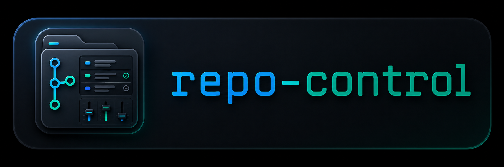

<p align="center">
  
</p>

# repo-control

Local dashboard to inspect and operate Git projects from one place.

## What it does

- scan a local folder for Git repositories
- show branch, working tree state, upstream and last commit
- inspect changes grouped by staged, modified, deleted, renamed and untracked files
- checkout, create, fetch and pull branches from a browser UI
- stage, unstage, commit and push selected projects
- open a project in VS Code
- start or rebuild Docker Compose projects
- run scoped terminal commands inside a selected project
- pick the workspace folder from the local file picker where supported
- update repo-control from the UI when a new release is available
- keep favorite repositories in a local machine preferences file
- stay local-first and bind to localhost by default

## Safety model

repo-control is intended as a local developer tool. It can execute Git, Docker and terminal commands on your machine, scoped to repositories discovered under the configured workspace folder.

Do not expose the web server or API to a public network. The default host is `127.0.0.1` on purpose.

## Requirements

- Node.js 20 or newer
- Git
- Docker, optional, only for Compose actions
- VS Code, optional, only for the open-in-editor action

## First run

```bash
npm install
npm run dev
```

The API reads projects from `REPO_CONTROL_ROOT`, or from the current working directory if the variable is not set.

```bash
REPO_CONTROL_ROOT=~/projects npm run dev
```

You can change the active workspace folder from the web UI without restarting the server.
Click the workspace folder bar to open the native folder picker where supported. On WSL, Windows paths are converted back to WSL paths before scanning.

If VS Code is not in the server process `PATH`, set `REPO_CONTROL_VSCODE` to the full launcher path.

repo-control stores local preferences outside Git by default:

- Windows: `%APPDATA%\repo-control\preferences.json`
- macOS: `~/Library/Application Support/repo-control/preferences.json`
- Linux/WSL: `~/.config/repo-control/preferences.json`

Frontend: <http://localhost:5173>

API: <http://localhost:3747>

## Configuration

Copy `.env.example` if you want to keep local settings outside the command line.

| Variable | Default | Description |
| --- | --- | --- |
| `HOST` | `127.0.0.1` | API host. Keep this local unless you know exactly what you are exposing. |
| `PORT` | `3747` | API port. |
| `LOG_LEVEL` | `error` | Server log level. Request/response logs are disabled by default. |
| `REPO_CONTROL_ROOT` | current directory | Workspace folder scanned for Git repositories. |
| `REPO_CONTROL_CONFIG_DIR` | OS user config folder | Optional directory for local preferences. |
| `REPO_CONTROL_SHELL` | auto-detect | Optional shell used by the embedded terminal command runner. |
| `REPO_CONTROL_VSCODE` | auto-detect | Optional full path to a VS Code launcher. |

## Features

- workspace map and table views
- project detail overlay with multi-project tabs
- Changes tab with grouped file status, stage all, unstage all, commit and push
- Branches tab with local and remote branches, ahead/behind, checkout, create branch, fetch and pull ff-only
- Docker Compose up and rebuild actions
- embedded command runner scoped to the selected project folder
- native folder picker with WSL/Windows path conversion
- favorite repositories persisted in local machine preferences

## Development checks

```bash
npm run typecheck
npm run build
```

## Releases

Release notes are published in [CHANGELOG.md](CHANGELOG.md) and GitHub Releases.

repo-control checks for newer release tags every 5 minutes while the UI is open. Use the `Aggiorna` button near the app version to update the local checkout when a newer release is available. The update is blocked if repo-control has local changes.

## License

MIT
