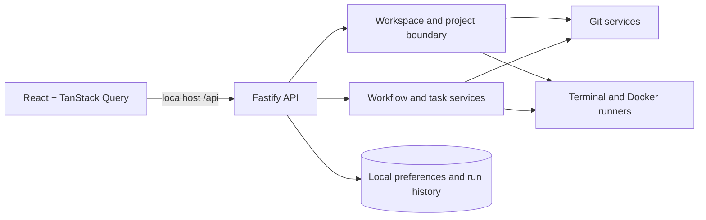

# repo-control

[](https://github.com/LorenzoVicino/repo-control/actions/workflows/ci.yml)

**A local-first command center for multi-repository workspaces.**

When work spans several repositories, the important state is scattered across terminal tabs, Git clients, Docker commands and mental notes. repo-control turns one workspace folder into a live operational view: what is clean, what is drifting, what needs attention and which action is safe to run next.

<p align="center">
  <a href="docs/repo-control-demo.webm">
    
  </a>
</p>

<p align="center"><sub>Dashboard → Ctrl+P repository search → scoped Git workspace → visual automations. The showcase uses synthetic repositories; click the GIF for the full-quality video.</sub></p>

## The problem

A normal multi-repository workflow creates three recurring costs:

- **State is fragmented.** Dirty trees, ahead/behind branches, recent activity and running containers live in different tools.
- **Context switching is expensive.** Routine work means repeatedly finding a folder, opening a terminal and reconstructing the repository context.
- **Automation can become unsafe.** Broad scripts are fast, but a command executed in the wrong directory can be destructive.

repo-control keeps the convenience of a dashboard without moving control to a remote service.

| Without repo-control | With repo-control |
| --- | --- |
| Inspect repositories one at a time | Triage the entire workspace from one live health view |
| Rebuild context before every command | Open Git, branches, terminal and Docker already scoped to a repository |
| Rely on ad-hoc scripts for repeated work | Compose explicit, inspectable workflows with dry runs and history |
| Send workspace metadata to another platform | Keep the API, preferences and command execution on the local machine |

## The core workflow

1. Point repo-control at a workspace folder.
2. Triage clean, modified, behind and ahead repositories from the Dashboard.
3. Jump to a project with `Ctrl+P` and inspect its real Git state.
4. Run focused Git, branch, terminal or Docker actions inside the selected repository boundary.
5. Turn repeated operations into visual workflows that can be inspected before execution.

## Why this is more than a dashboard

- **Local-first safety boundary.** The Fastify API binds to `127.0.0.1` by default, resolves project identifiers server-side and scopes commands to discovered repositories.
- **Real developer operations.** The UI reads actual Git and Docker state and exposes explicit actions instead of simulating a project-management view.
- **Typed full-stack design.** TypeScript, Zod schemas and domain-specific API clients keep the React and Fastify sides aligned.
- **Failure-aware UX.** Long-running commands report output, exit state and errors; destructive operations remain explicit user actions.
- **Verifiable engineering quality.** Server tests, React Testing Library, coverage thresholds and Playwright browser flows run in CI across Node.js 20, 22 and 24.

## Main capabilities

| Area | Outcome |
| --- | --- |
| Workspace health | See clean, modified, ahead and behind repositories together, with recent commit activity and favorites. |
| Git workspace | Inspect staged and unstaged changes, stage files, commit, stash, fetch, pull and push without losing repository context. |
| Branches | Compare local and remote branches, create or check out branches and track upstream divergence. |
| Local tooling | Open a repository in VS Code, run scoped terminal commands and operate Docker Compose projects. |
| Automations | Build visual Git, Docker and terminal workflows with dry runs, execution history and reusable nodes. |
| Task engineering | Turn a short brief into repository-aware planning and implementation flows, with optional Claude Code integration. |

## Architecture at a glance


```mermaid
flowchart LR
    UI[React + TanStack Query] -->|localhost /api| API[Fastify API]
    API --> Boundary[Workspace and project boundary]
    Boundary --> Git[Git services]
    Boundary --> Commands[Terminal and Docker runners]
    API --> Workflow[Workflow and task services]
    Workflow --> Git
    Workflow --> Commands
    API --> Local[(Local preferences and run history)]
```

The browser never chooses an arbitrary working directory for a command. It sends a project identifier; the server resolves and validates the corresponding path under the active workspace. See [Architecture](docs/architecture.md) for module boundaries and placement conventions.

## Try it in under two minutes

Requirements: Git and Node.js 20.19+, 22.13+ or 24+ (Node 24 recommended).

```bash
git clone https://github.com/LorenzoVicino/repo-control.git
cd repo-control
npm ci
REPO_CONTROL_ROOT=~/projects npm run dev
```

Open <http://127.0.0.1:5173>. If `REPO_CONTROL_ROOT` is omitted, repo-control scans the current working directory. The workspace can also be changed from the UI without restarting the server.

Docker and VS Code are optional and only needed for their corresponding actions. Claude Code is optional and only required for AI-assisted planning and engineering runs.

## Safety model

repo-control can execute Git, Docker and terminal commands on your machine. Its safety model is intentionally narrow:

- the API and web server bind to localhost by default;
- project commands are resolved against repositories discovered under the active workspace;
- destructive actions such as discarding changes or force pushing are not implicit flows;
- credentials and workspace content stay local unless an explicitly configured external tool is invoked;
- personal paths, tokens and machine-specific preferences are excluded from version control.

Do not expose the web server or API to a public network without adding an authentication and authorization layer.

## Configuration

Copy `.env.example` when local settings should live outside the command line.

| Variable | Default | Description |
| --- | --- | --- |
| `HOST` | `127.0.0.1` | API host. Keep this local unless you know exactly what you are exposing. |
| `PORT` | `3747` | API port. |
| `LOG_LEVEL` | `error` | Server log level. Request/response logs are disabled by default. |
| `REPO_CONTROL_ROOT` | current directory | Workspace folder scanned for Git repositories. |
| `REPO_CONTROL_CONFIG_DIR` | OS user config folder | Optional directory for local preferences. |
| `REPO_CONTROL_SHELL` | auto-detect | Shell used by the embedded terminal runner. |
| `REPO_CONTROL_VSCODE` | auto-detect | Optional full path to a VS Code launcher. |
| `REPO_CONTROL_CLAUDE` | `claude` | Optional full path to the Claude Code executable. |

Local preferences are stored outside Git by default:

- Windows: `%APPDATA%\repo-control\preferences.json`
- macOS: `~/Library/Application Support/repo-control/preferences.json`
- Linux/WSL: `~/.config/repo-control/preferences.json`

### Windows with WSL

For launches from a Windows `.bat` through WSL, use the bundled startup script:

```bash
./scripts/start-repo-control.sh
```

It explicitly loads `nvm` before installing dependencies and starting the app, avoiding the outdated system Node.js that non-interactive WSL sessions can otherwise select.

## Engineering checks

```bash
npm run verify
npm run test:e2e
```

`verify` runs ESLint, React Hooks validation, strict TypeScript checks, server and React tests with coverage thresholds, and the production build. `test:e2e` starts the real local API and dashboard, then exercises the critical browser-to-API-to-Git flow in Chromium.

CI repeats the verification gate on Node.js 20.19, 22.13 and 24, then runs the browser suite. Pull requests to `main` require those checks before merging.

## Releases

Release notes are published in [CHANGELOG.md](CHANGELOG.md) and [GitHub Releases](https://github.com/LorenzoVicino/repo-control/releases). While the UI is open, repo-control periodically checks for a newer tag and can update a clean local checkout from the app.

## License

MIT
