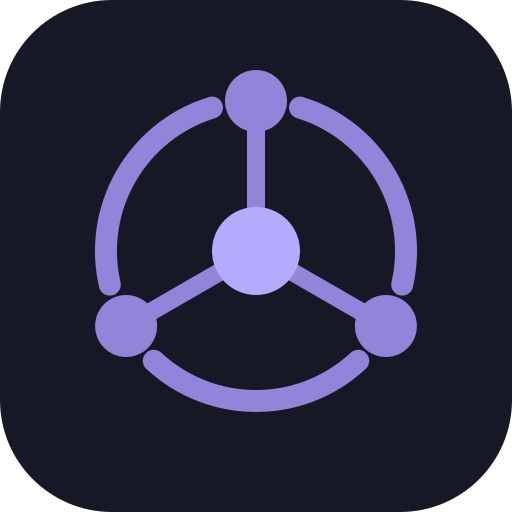
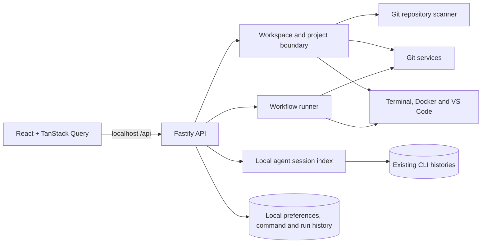

<p align="center">
  
</p>

<h1 align="center">repo-control</h1>

<p align="center"><strong>A local-first command center for multi-repository workspaces.</strong></p>

When work spans several repositories, the important state is scattered across terminal tabs, Git clients, Docker commands and local AI-agent sessions. repo-control turns one workspace folder into a live operational view: what is clean, what is drifting, what needs attention and which action is safe to run next.

<p align="center">
  <a href="docs/repo-control-demo.webm">
    
  </a>
</p>

<p align="center"><sub>Dashboard → repository catalog → Ctrl+P search → repository overview → branches → persistent terminal → Task Engineering. Captured from the live v0.7.0 application with local paths normalized; click the GIF for the full-quality video.</sub></p>

## The problem

A normal multi-repository workflow creates three recurring costs:

- **State is fragmented.** Dirty trees, ahead/behind branches, recent activity, running containers and agent conversations live in different tools.
- **Context switching is expensive.** Routine work means repeatedly finding a folder, opening a terminal and reconstructing the repository context.
- **Automation can become unsafe.** Broad scripts are fast, but a command executed in the wrong directory can be destructive.

repo-control keeps the convenience of a dashboard without moving control to a remote service.

| Without repo-control | With repo-control |
| --- | --- |
| Inspect repositories one at a time | Triage the entire workspace from one live health view |
| Rebuild context before every command | Open Git, branches, terminal and Docker already scoped to a repository |
| Search each AI CLI's history separately | Find and resume local Codex, Claude Code and Gemini CLI sessions together |
| Rely on ad-hoc scripts for repeated work | Compose explicit, inspectable workflows with dry runs, live progress and history |

## The core workflow

1. Point repo-control at a workspace folder. It discovers Git repositories recursively while skipping common dependency and build directories.
2. Triage clean, modified, behind and ahead repositories from the Dashboard.
3. Jump to a project with `Ctrl+P`; its Overview surfaces working-tree health, sync drift, Docker state and recent commits before any action is needed.
4. Inspect a file diff, prepare a commit, work with branches, run a terminal command or operate Docker without leaving the selected repository boundary.
5. Find a local agent conversation associated with a discovered repository and resume it in a native terminal.
6. Turn repeated operations into visual workflows that can be previewed, monitored and cancelled.

## Why this is more than a dashboard

- **Local-first safety boundary.** The Fastify API binds to `127.0.0.1` by default, resolves project identifiers server-side and scopes project commands to discovered repositories.
- **Real developer operations.** The UI reads actual Git and Docker state and exposes explicit actions instead of simulating a project-management view.
- **Private session discovery.** Agent history is read from the CLI files already on the machine, filtered to the active workspace and searched locally.
- **Failure-aware automation.** Background runs expose live step results, can be cancelled and stop downstream work after a failed action.
- **Verifiable engineering quality.** Server tests, React Testing Library, 80% coverage thresholds and Playwright browser flows run in CI across Node.js 20, 22 and 24.

## Main capabilities

| Area | Outcome |
| --- | --- |
| Workspace health | See clean, modified, ahead and behind repositories together, with recent commit activity and favorites. |
| Agent sessions | Search local Codex, Claude Code and Gemini CLI conversations by title or content, filter by provider and resume them from the matching repository. |
| Repository overview | Triage attention items, working-tree health, upstream drift, Compose services and recent commits from one full-width landing view. |
| Git workspace | Inspect staged and unstaged files with an inline text diff and staged line summary; stage, unstage, commit, stash, fetch, pull and push without losing repository context. |
| Branches | Search local and remote branches, identify the default and merged branches, inspect each latest commit and upstream divergence, then create or check out safely. Dirty checkouts are blocked from branch changes. |
| Local tooling | Open a repository in VS Code and run scoped terminal commands whose output survives project-tab navigation and whose active process can be stopped. |
| Docker Compose | Inspect configured and stopped services, health, images and published ports; open web ports, tail per-service logs, restart a service or operate the complete stack. |
| Automations | Build visual Git, Docker and terminal workflows with graph validation, runtime text inputs, dry runs, background execution, cancellation and inspectable history. |

The repository Docker tab is capability-driven and appears only for repositories with a Compose file. Workspace-level Docker navigation is shown only when the Docker CLI is available. Docker and VS Code are optional; their controls require the corresponding local tool. There is no speculative Deploy tab: a future CI/CD tab should appear only after repo-control detects a supported pipeline for that repository.

### Agent session discovery

The **Agent sessions** page reads the standard local histories created by Codex, Claude Code and Gemini CLI. Only conversations whose working directory belongs to a repository discovered in the active workspace are shown. Search runs on the local API and results are not copied into repo-control's configuration directory.

Resuming a session requires the matching CLI and a supported graphical terminal. repo-control auto-detects common terminals on Linux, macOS and Windows; under WSL it opens Windows Terminal in the current distribution when available. Command and terminal paths can be overridden through environment variables.

### Runtime inputs for automations

Add an **Input di testo** node when a workflow needs a value at launch, then reference its key from a terminal node with `{{inputs.key}}`. Preview and execution both prompt for required values. repo-control passes each value through an execution-scoped environment variable instead of concatenating raw text into the shell command.

Workflow runs execute in the background and report pending, running and terminal states. Only one run per workflow can be active at a time. A server restart marks unfinished runs as interrupted rather than silently leaving them active.

## Architecture at a glance


```mermaid
flowchart LR
    UI[React + TanStack Query] -->|localhost /api| API[Fastify API]
    API --> Boundary[Workspace and project boundary]
    Boundary --> Scan[Git repository scanner]
    Boundary --> Git[Git services]
    Boundary --> Commands[Terminal, Docker and VS Code]
    API --> Agents[Local agent session index]
    API --> Workflow[Workflow runner]
    Workflow --> Git
    Workflow --> Commands
    API --> Local[(Local preferences, command and run history)]
    Agents --> CLIs[(Existing CLI histories)]
```

The browser never chooses an arbitrary working directory for a project command. It sends a project identifier; the server resolves and validates the corresponding path under the active workspace. See [Architecture](docs/architecture.md) for module boundaries, persistence and placement conventions.

## Try it in one command

Requirements: Git and Node.js 20.19+, 22.13+ or 24+ (Node 24 recommended).

```bash
npx repo-control ~/projects
```

That starts the API, serves the dashboard from the same port and opens <http://127.0.0.1:3747>. With no folder argument repo-control scans the current directory, and the workspace can be changed from the UI without restarting the server.

```
repo-control [workspace] [options]

  -p, --port <port>    Port to listen on (default 3747)
      --host <host>    Address to bind (default 127.0.0.1)
      --no-open        Do not open the dashboard in a browser
  -v, --version        Print the version
  -h, --help           Show usage
```

To keep it around, install it globally with `npm install -g repo-control` and run `repo-control`.

### Run from source

Contributors and anyone who wants the Vite dev server:

```bash
git clone https://github.com/LorenzoVicino/repo-control.git
cd repo-control
npm ci
REPO_CONTROL_ROOT=~/projects npm run dev
```

Open <http://127.0.0.1:5173>. In this mode Vite serves the UI and proxies `/api` to the Fastify process on port 3747. The npm version is pinned via `packageManager` and installed by CI; match it locally before regenerating the lockfile. `npm start` runs the packaged layout instead, serving the built dashboard from the API port exactly as the published binary does.

For optional integrations, install the tools you intend to use:

- Docker CLI with Compose for container discovery and Compose actions;
- VS Code with a working `code` launcher for **Open in VS Code**;
- Codex, Claude Code or Gemini CLI for session resume.

## Configuration

Copy `.env.example` to `.env` when local settings should live outside the command line. `npm run dev:server` loads this file when present.

### Server and workspace

| Variable | Default | Description |
| --- | --- | --- |
| `HOST` | `127.0.0.1` | API bind address. Keep this local unless an authentication layer is added. |
| `PORT` | `3747` | API port. |
| `LOG_LEVEL` | `error` | Fastify log level: `fatal`, `error`, `warn`, `info`, `debug`, `trace` or `silent`. Request logging remains disabled. |
| `REPO_CONTROL_ROOT` | current directory | Workspace folder scanned recursively for Git repositories. |
| `REPO_CONTROL_CONFIG_DIR` | OS user config folder | Override the directory used for repo-control's local JSON files. |
| `REPO_CONTROL_SERVE_WEB` | off | Serve the built dashboard from the API process. Set automatically by the `repo-control` binary and by `npm start`; leave it off during `npm run dev`, where Vite owns the UI. |

### Local tools and agent CLIs

| Variable | Default | Description |
| --- | --- | --- |
| `REPO_CONTROL_SHELL` | platform shell | Shell used by project terminal commands and automation terminal nodes. |
| `REPO_CONTROL_VSCODE` | auto-detect | Full path or command for the VS Code launcher. |
| `REPO_CONTROL_CLAUDE` | `claude` | Claude Code command used for detection and session resume. |
| `REPO_CONTROL_CODEX` | `codex` | Codex command used for detection and session resume. |
| `REPO_CONTROL_GEMINI` | `gemini` | Gemini CLI command used for detection and session resume. |
| `REPO_CONTROL_TERMINAL` | auto-detect | Graphical terminal command used to resume agent sessions outside WSL. It must support `-e`. |
| `REPO_CONTROL_WINDOWS_TERMINAL` | auto-detect | Windows Terminal executable used for agent session resume under WSL. |

repo-control also respects `CODEX_HOME` and `CLAUDE_CONFIG_DIR` when locating those tools' existing session histories.

If the development API runs somewhere other than `http://127.0.0.1:3747`, export `REPO_CONTROL_API_URL` in the shell before starting Vite. This development-only proxy setting is not loaded from the root `.env` by the server process.

### Local data

repo-control stores its own data outside Git by default:

- Windows: `%APPDATA%\repo-control`
- macOS: `~/Library/Application Support/repo-control`
- Linux/WSL: `${XDG_CONFIG_HOME:-~/.config}/repo-control`

The directory contains `preferences.json`, `terminal-history.json`, `workflows.json` and `workflow-runs.json` as those features are used. Terminal command suggestions persist in `terminal-history.json`; the visible terminal transcript stays mounted while its repository remains open, but is not written to disk. Workflow history includes command output and retains at most 100 runs. Older task-engineering data, if present, remains in the `brain/` subdirectory. UI palette and dashboard quote choices are kept in browser local storage.

### Windows with WSL

For launches from a Windows `.bat` through WSL, use the bundled startup script:

```bash
./scripts/start-repo-control.sh
```

It loads `nvm` when available, validates the Node.js version, installs dependencies and starts the app. This avoids the outdated system Node.js that non-interactive WSL sessions can otherwise select.

## Safety and privacy model

repo-control can execute Git, Docker and terminal commands on your machine. Its safety model is intentionally narrow:

- the API and Vite development server bind to localhost by default and have no authentication layer;
- project commands are resolved against repositories discovered under the active workspace;
- branch changes are rejected for dirty repositories, pull uses `--ff-only`, and force push or implicit discard flows are not exposed;
- only one terminal command per repository can run at a time, and its active process tree can be cancelled from the repository terminal;
- workflow execution is blocked when the visible graph is invalid, downstream steps stop after a command failure and active runs can be cancelled;
- agent search reads local transcript content, but only returns matching summaries or snippets for sessions associated with the active workspace;
- credentials and workspace content stay local unless a command or resumed external tool sends them elsewhere.

Do not expose the web server or API to a public or untrusted network. Review terminal commands and automation definitions before running them, and remember that saved terminal history and workflow output may contain sensitive values. See [Security](SECURITY.md) for the supported trust boundary.

## Engineering checks

```bash
npm run verify
npm run test:e2e
```

`verify` runs ESLint (including React Hooks rules), strict TypeScript checks, server and React tests with 80% coverage thresholds, and the production build. `test:e2e` starts the real local API and dashboard, then exercises critical browser-to-API flows in Chromium.

CI repeats the verification gate on Node.js 20.19, 22.13 and 24, then runs the browser suite on Node.js 24.

## Releases

Release notes are published in [CHANGELOG.md](CHANGELOG.md) and on the repository's GitHub Releases page. While the UI is open, repo-control checks the tags on `origin` for a newer semantic version and can update a clean local checkout from the app. In-app updating applies only to a Git checkout: an npm install has no repository to pull, reports so in the UI, and is upgraded with `npx repo-control@latest` or `npm install -g repo-control@latest`.

## Contributing and license

See [CONTRIBUTING.md](CONTRIBUTING.md) before sharing changes. repo-control is released under the [MIT License](LICENSE).
