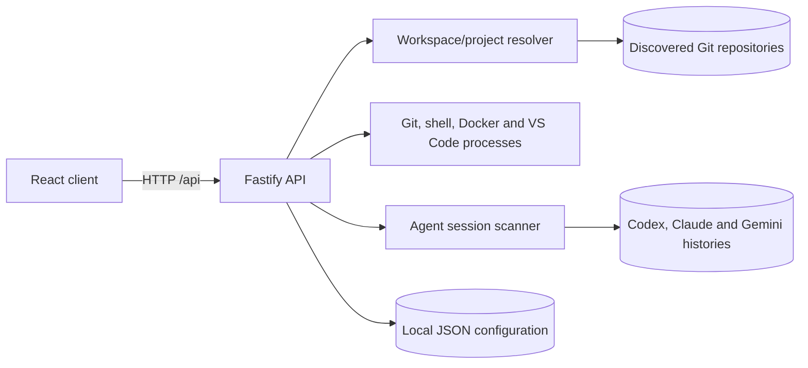

# Architecture

repo-control is a local-first TypeScript application with a Fastify API and a React client. Code is grouped by runtime first, then by domain or responsibility.

## Runtime topology

During development, Vite serves the React app on `127.0.0.1:5173` and proxies `/api` to Fastify on `127.0.0.1:3747`. Both bind to localhost by default.



The browser sends project identifiers, never an arbitrary working directory for a project action. The server decodes the identifier, verifies that the path is inside the active workspace and confirms that it is a discovered Git repository before executing a command there.

Changing the active workspace updates in-memory resolver state. It does not rewrite `.env` or restart the process.

## Server

```text
apps/server/src/
  config/       environment parsing and runtime configuration
  lib/          command execution and project-boundary helpers
  routes/       HTTP schemas, request validation and response mapping
  services/     application use cases and external-tool integrations
    brain/      legacy Task engineering contracts and persistence helpers
    workflow/   workflow schemas, validation, inputs and JSON storage
  docker.ts     Docker discovery plus Compose service, health and port normalization
  folderPicker.ts
                native workspace selection across supported platforms
  gitScanner.ts recursive repository discovery and summary reads
  preferences.ts
                OS-specific configuration-directory ownership
  runtime.ts    shell and VS Code detection
  terminalMemory.ts
                local command suggestions
```

Routes should stay thin: validate input, call a service and translate expected errors to HTTP responses. Services own application behavior. File persistence, normalization and compatibility code belong in a domain subdirectory rather than in the service orchestrator.

Current route domains are:

| Domain | Responsibility |
| --- | --- |
| `authRoutes` | Sign-in state, sign-in and sign-out when credentials are configured. |
| `appRoutes` | Health, workspace discovery and selection, favorites, updates and VS Code launch. |
| `agentSessionRoutes` | Workspace-scoped agent history search and validated native-terminal resume. |
| `gitRoutes` | Git details, activity, file diffs, staged summaries, staging, commits, stashes, sync and branches. |
| `terminalRoutes` | Scoped shell execution, one active command per repository, cancellation and command suggestions. |
| `dockerRoutes` | Container discovery, resource samples, container shell and log sessions, plus validated Compose service state, logs, restart and stack actions. |
| `workflowRoutes` | Workflow CRUD, dry runs, background runs, progress reads and cancellation. |
| `brainRoutes` / `claudeRoutes` | Task-engineering backend retained while its UI entry point is hidden pending redesign. |

### Container sessions

`createContainerSessionStore` owns the processes behind the container console. A session is a long-lived `docker` client - `docker exec -i <id> <shell>` or `docker logs --follow <id>` - which the one-shot command runner cannot represent, because that runner resolves only once a process has exited.

Each session keeps its output in a capped buffer with a monotonic character cursor. The client sends the cursor it last saw and receives everything after it, so a slow poll loses nothing that is still inside the window, and a read that starts before the retained window is answered with `truncated: true` rather than a silent gap. stdout and stderr share one buffer, because a terminal interleaves them.

Sessions are capped in number, dropped after an idle period with no reads, and closed on server shutdown; exited sessions keep their transcript readable but release their slot. The store takes an injectable spawner, so its lifecycle is tested against real pipes without a Docker daemon.

Container-scoped routes validate the ID shape and then revalidate it against the running containers, which is the container equivalent of resolving a project ID against discovered repositories: the browser never names a process to run, only a container the daemon already reports.

### Sign-in

`createAuthGuard` owns the optional credential check. It is enabled only when `REPO_CONTROL_AUTH_USERNAME` and `REPO_CONTROL_AUTH_PASSWORD` are both set; with one of the two, `readEnv` rejects the configuration and the server does not start.

When enabled, an `onRequest` hook registered after the `Host` check rejects `/api` requests without a valid session cookie, so an unauthenticated caller never reaches project resolution or command execution. `/api/auth/*` and `/api/health` stay reachable - the dashboard has to ask whether a sign-in is required, and a supervisor has to be able to probe the API - and the health route withholds the workspace root until the caller is authenticated. Non-`/api` paths are never gated: the dashboard bundle has to load for the sign-in screen to exist.

Sessions are opaque tokens stored as digests in process memory with an expiry, sent as an `HttpOnly`, `SameSite=Strict` cookie. Nothing is persisted, so a restart ends every session. Credential comparison is constant-time and repeated failures pause sign-in briefly.

### Project boundary

`createProjectResolver` owns the active root and project resolution. Project IDs are base64url-encoded paths relative to that root. Resolution rejects traversal, paths outside the root and directories that are not Git repositories.

Keep this boundary in server code. New browser APIs should accept a project ID and derive the working directory through the resolver; they should not accept a client-provided absolute path.

### Agent sessions

Agent discovery reads the tools' existing local files concurrently:

- Codex JSONL sessions under `CODEX_HOME` or `~/.codex`;
- Claude Code project transcripts under `CLAUDE_CONFIG_DIR` or `~/.claude`;
- Gemini CLI chats under `~/.gemini`.

Candidates are associated with the most specific discovered repository containing their recorded working directory. Search is performed server-side over titles and transcript messages. Resume requests are revalidated against both the session scan and the project resolver before a detached native terminal is opened.

### Workflow execution

Workflow definitions are validated as a connected, directed graph before preview or execution. Text inputs are resolved into execution-scoped environment variables. A real run is persisted as `pending` and returned with HTTP 202; the client polls its run ID while the server executes steps in the background.

Only one active run is allowed per workflow. Cancellation propagates an `AbortSignal` to running commands. On startup, persisted `pending` or `running` records are marked `interrupted` because their in-memory controllers cannot be recovered.

Failure is tracked per repository, not per run: a repository whose step fails is skipped by the steps that follow, while the others carry on. The summary node is never skipped, because the run that failed is the one whose outcome has to be readable. Each node decides per repository whether it can act at all and returns the reason next to the guard that produced it, so a skip message cannot drift from the condition behind it.

## Web

```text
apps/web/src/
  api/          API clients split by domain; http.ts owns shared transport behavior
  components/   UI grouped by feature
    agents/     unified local agent history
    auth/       sign-in screen, shared session read and sidebar profile menu
    automation/ visual workflow editor, execution and history
    dashboard/  navigation, health views and repository discovery
    docker/     container console sessions and resource-usage formatting
    project/    capability-driven overview, Git diff, branch, terminal and Docker panels
    settings/   local interface preferences: language, palette and text size
    shared/     reusable presentation components with no feature ownership
    task/       hidden Task engineering UI retained for redesign work
  types/        API and UI contracts split by domain
  utils/        pure cross-feature helpers
```

Feature components import their own API module and domain types directly. Avoid adding a global API client or type barrel: explicit imports keep dependencies visible and prevent unrelated features from becoming coupled.

Large pages should orchestrate data and navigation. Extract independent panels, dialogs and pure domain logic once they have their own state, props or testable behavior.

Repository details use a single full-width shell: Overview is the default and feature tabs are rendered only when their repository capability exists. Docker currently follows this rule through Compose-file detection. Deploy is intentionally absent; any future CI/CD tab must be backed by detected pipeline configuration and real status/actions rather than a static placeholder. Once opened, the terminal panel remains mounted while the repository workspace stays open so its transcript and active request survive navigation between repository tabs.

The application shell reads the sign-in state once and chooses between the sign-in screen and the dashboard from it. A request that any feature makes and the API answers with `401 UNAUTHENTICATED` updates that same cached state through the shared query cache, so a lapsed session returns to the sign-in screen instead of leaving a page of failed panels behind. An unreadable sign-in state falls through to the dashboard on purpose: the API enforces the gate, and a local tool should not lock its owner out because one request failed.

Dashboard sections are lazy-loaded. Task engineering still has code and server endpoints but is deliberately absent from the sidebar, the section router and quick actions; documentation and user-facing navigation should not present it as a current capability until the redesign is complete.

Interface preferences are owned by the application shell rather than by the screen that presents them: `App.tsx` holds the palette and text size, writes them to `localStorage` and passes them down, so the theme is rebuilt in one place. Both are offered twice on purpose - as a quick switch in the sidebar profile menu and as a described choice in the settings section - and the profile menu is the only sign-out entry point. It renders whether or not credentials are configured, because a workspace with no session still has preferences to reach.

Text size is applied through the theme's `unstable_sxConfig` transform for `fontSize`, not by editing components. Most type sizes here are written inline as `sx={{ fontSize: 10.5 }}`, so scaling `typography` alone would grow the headings and leave the small mono labels untouched; the transform reaches every inline number, the themed sizes and the icon sizes from one definition. A new inline size therefore scales automatically, and a size that must stay fixed is written as a CSS string.

## Persistence

`getConfigDirectory()` provides the single root for repo-control-owned server data. `REPO_CONTROL_CONFIG_DIR` overrides the OS default.

| Path below the config directory | Contents |
| --- | --- |
| `preferences.json` | Favorite project IDs. |
| `terminal-history.json` | Normalized terminal commands, repository paths, counts and last-used times; capped at 500 entries. |
| `workflows.json` | Visual workflow definitions. |
| `workflow-runs.json` | The latest 100 dry runs and real runs, including step commands and output. |
| `brain/*.json` | Existing Task engineering records retained by the hidden backend. |

Agent transcripts remain in their provider-owned directories and are not copied here. Palette, text size and dashboard quote preferences are browser `localStorage`, not server JSON.

Writes that can race use temporary files plus rename. Workflow definition and run-history mutations also have separate in-process queues to prevent lost updates.

## Dependency direction

- Web components may depend on `api`, `types` and `utils`.
- API modules may depend on `api/http.ts` and domain types, never on components.
- Server routes may depend on services and `lib` contracts.
- Services may depend on domain helpers and infrastructure, never on routes.
- Domain normalization and persistence modules should not import HTTP or UI code.
- Platform detection belongs in server runtime services, not React components.

## Quality gates

Run the following before sharing a change:

```bash
npm run verify
npm run test:e2e
```

`verify` runs ESLint, React Hooks validation, the strict TypeScript compiler, server and React test suites with 80% global coverage thresholds, and the production web build. `test:e2e` starts the real local server and dashboard, then verifies critical user flows in Chromium.

The GitHub Actions matrix runs `verify` on Node.js 20.19, 22.13 and 24. Browser E2E runs on Node.js 24 after the matrix succeeds.
